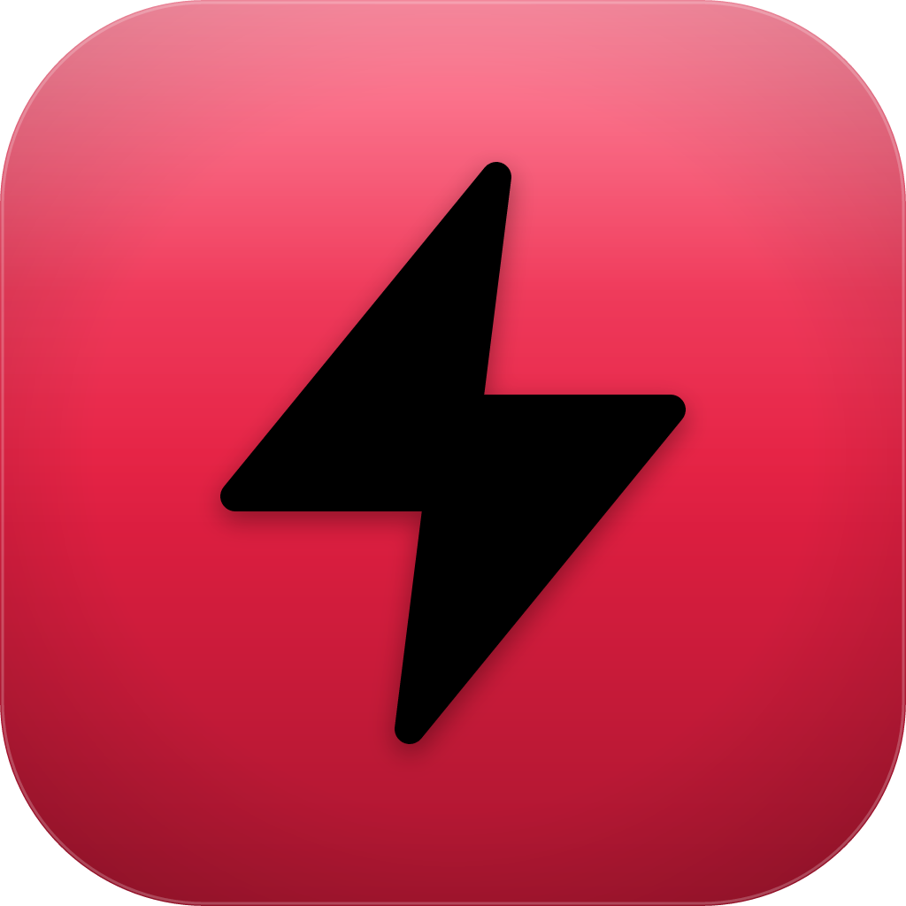
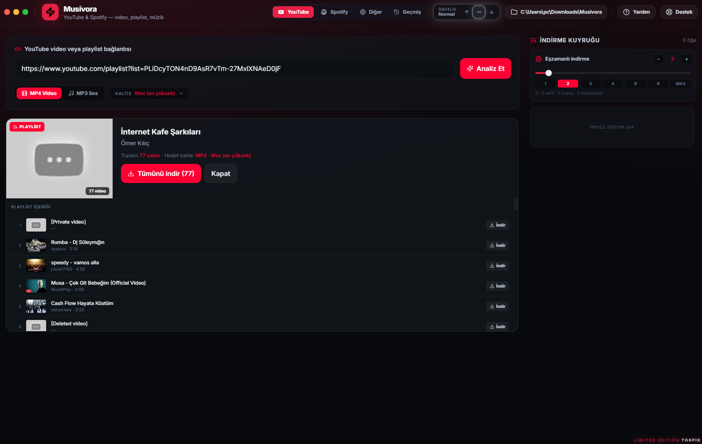
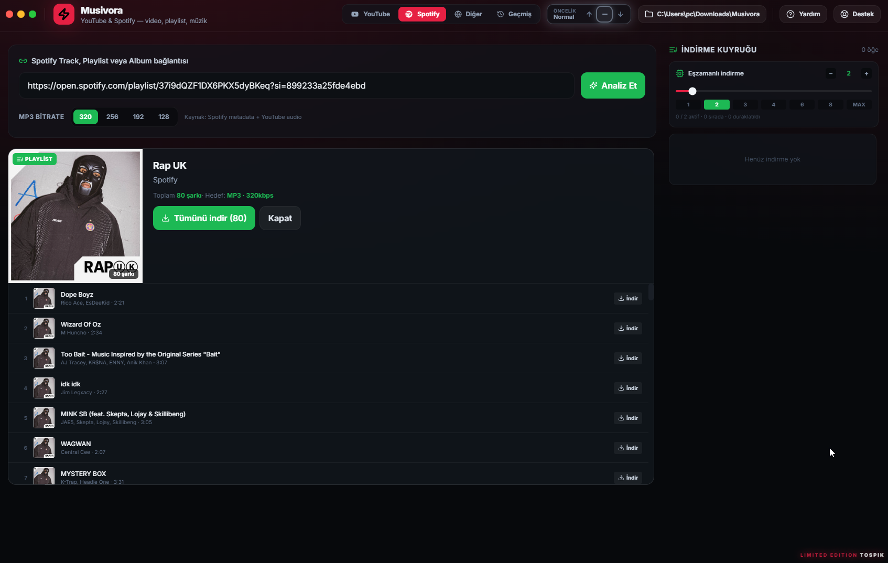
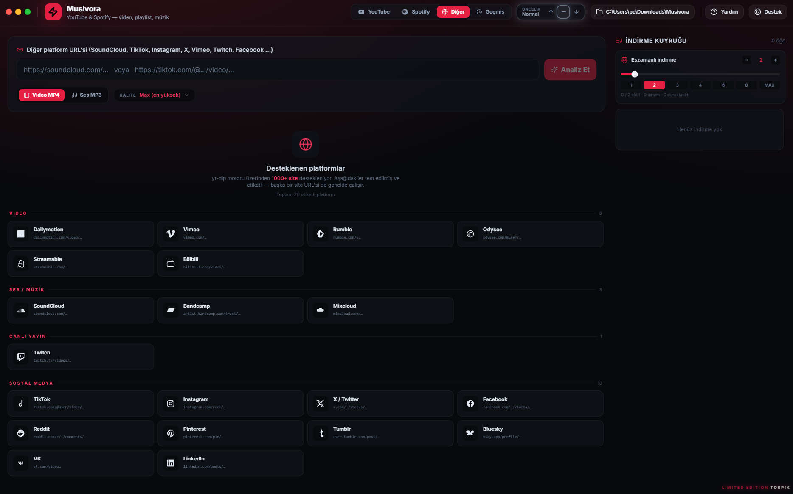
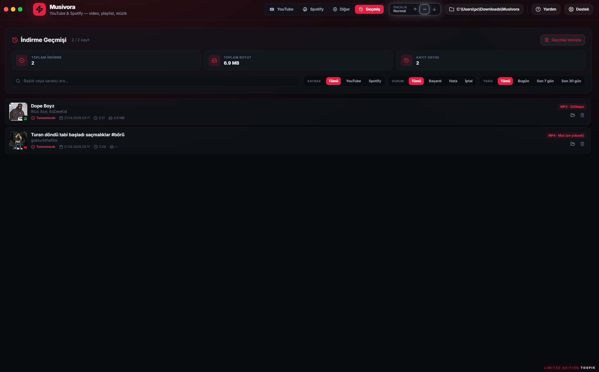

# Musivora

**YouTube & Spotify indirici**

MP4 (8K'ya kadar) · MP3 (320 kbps) · Playlist · 20+ platform · Geçmiş · Tepsi entegrasyonu

---

## 📥 İndir

**[⬇️ Musivora-Setup-1.0.0.zip](https://github.com/Fatihstf/Musivora/releases/latest)**

ZIP'i çıkart → `Musivora-Setup-1.0.0.exe`'yi çalıştır → Standart kurulum sihirbazı → Kurulum tamam.

İlk açılışta `yt-dlp.exe` (~15 MB) otomatik `%AppData%\Musivora\bin` içine iner. ffmpeg uygulamaya gömülü.

---

## 🔧 Nasıl çalışır?

1. Uygulamayı aç
2. Sağ üstten **Klasör seç** ile indirme hedefini belirle
3. Bir sekme seç:
   - **YouTube** — video veya playlist URL'si
   - **Spotify** — track / playlist / album URL'si
   - **Diğer** — SoundCloud, TikTok, Instagram, X, Vimeo, Twitch, Facebook, Reddit, Pinterest, Bandcamp, Mixcloud, Rumble, Odysee, Bilibili, Dailymotion, Tumblr, VK, Bluesky, LinkedIn, Streamable
4. URL yapıştır → **Analiz Et**
5. Kalite seç (MP4: 360p → 8K, MP3: 96–320 kbps)
6. **Kuyruğa ekle** veya playlist için **Tümünü indir**
7. Sağ panelde anlık ilerleme, **Geçmiş** sekmesinde kalıcı kayıt

Pencereyi kapatsan bile indirme sürer — sistem tepsisinden kontrol edebilirsin.

---

## 📸 Ekran görüntüleri

<table>
<tr>
<td width="50%"></td>
<td width="50%"></td>
</tr>
<tr>
<td align="center"><strong>YouTube</strong> — tekli video ve playlist</td>
<td align="center"><strong>Spotify</strong> — track, playlist, album</td>
</tr>
<tr>
<td></td>
<td></td>
</tr>
<tr>
<td align="center"><strong>Diğer platformlar</strong> — 20+ site destekli</td>
<td align="center"><strong>İndirme geçmişi</strong> — filtrelenebilir kayıt</td>
</tr>
</table>

---

## 💻 Gereksinimler

- **Windows 10 / 11** (x64)
- 500 MB disk alanı
- İnternet bağlantısı (ilk `yt-dlp.exe` indirmesi için)

---

## 🤝 İletişim

- **Yardım**: [discord.com/invite/tospik](https://discord.com/invite/tospik)
- **Destek**: [kick.com/tospik](https://kick.com/tospik)

---

## 📜 Lisans

[MIT](LICENSE) © 2026 Fatih.stf

⚡ Sınırlı Sürüm · TOSPIK ⚡

